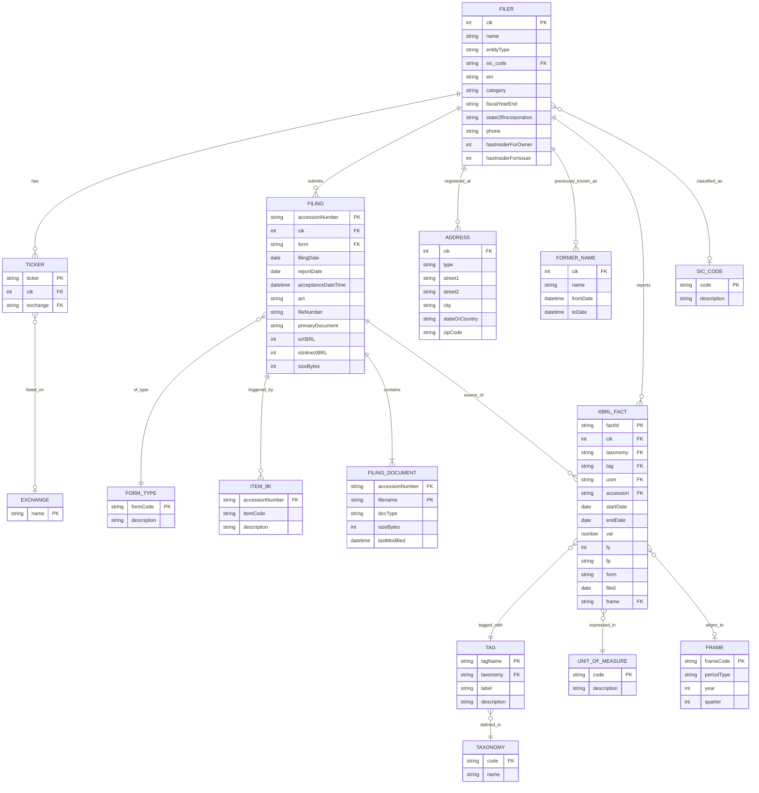

# SEC EDGAR API — Entity Relationship Diagram

> A normalized view of the data model behind the 10 EDGAR endpoints. The API itself is denormalized JSON — this diagram is how you should *think* about the data if you're loading it into a relational store or designing an ingestion pipeline.

**Companion to:** `edgar-api-exploration.md` (endpoint reference) and `edgar-api-data-dictionary.xlsx` (field-level dictionary).

**Standalone diagram file:** `edgar-api-erd.mermaid`

---

## The diagram



---

## Entity glossary

There are **15 entities** in this model, grouped into four clusters.

### Registrant cluster (who)

| Entity | What it represents | Natural key |
|---|---|---|
| **FILER** | A registered SEC entity (company, fund, trust). The atomic "who" that submits filings. | `cik` |
| **TICKER** | A trading symbol. A filer can have 0, 1, or multiple (e.g. GOOG + GOOGL). | `ticker` |
| **EXCHANGE** | Listing venue (Nasdaq, NYSE, OTC, etc.). Reference table. | `name` |
| **SIC_CODE** | Industry classification. Reference table. | `code` (4-digit) |
| **ADDRESS** | Mailing or business address; one filer has 1–2. | composite |
| **FORMER_NAME** | Historical legal name with date range. | composite |

### Filing cluster (what + when)

| Entity | What it represents | Natural key |
|---|---|---|
| **FILING** | A single submitted filing (10-K, 8-K, etc.). The "what happened" record. | `accessionNumber` |
| **FORM_TYPE** | Reference list of form codes (10-K, 10-Q, 8-K, 4, 13F-HR, DEF 14A, ...). | `formCode` |
| **ITEM_8K** | 8-K item codes that classify the event type (2.02 earnings, 5.02 exec change, ...). Only applies to 8-K filings. | composite |
| **FILING_DOCUMENT** | A file inside the filing's archive folder (primary doc, exhibits, XBRL, R-reports). | composite |

### XBRL fact cluster (measurements)

| Entity | What it represents | Natural key |
|---|---|---|
| **XBRL_FACT** | A single reported numeric value for a (filer, tag, unit, period). The row you'd put in a fact table. | surrogate |
| **TAG** | An XBRL concept definition (e.g. `Revenues`, `Assets`, `NetIncomeLoss`). | `tagName` within taxonomy |
| **TAXONOMY** | The XBRL taxonomy that owns a tag (`us-gaap`, `dei`, `ifrs-full`, `srt`). | `code` |
| **UNIT_OF_MEASURE** | The unit a fact is expressed in (`USD`, `shares`, `pure`, `USD/shares`). | `code` |
| **FRAME** | Standardized calendar-period bucket (`CY2023Q4I`, `CY2023Q4`, `CY2023`). Not every fact aligns to a frame. | `frameCode` |

---

## Relationship notes

Cardinality in mermaid notation: `||` = exactly one, `o|` = zero-or-one, `o{` = zero-or-more, `|{` = one-or-more.

| From | → To | Reading |
|---|---|---|
| FILER → TICKER | `1 : 0..N` | One filer can have many tickers (share classes). |
| FILER → FILING | `1 : 0..N` | One filer submits many filings (~decades of history). |
| FILER → ADDRESS | `1 : 0..N` | Typically 1 mailing + 1 business; often identical. |
| FILER → FORMER_NAME | `1 : 0..N` | Empty for most; populated after renames. |
| FILER → XBRL_FACT | `1 : 0..N` | Non-XBRL filers have zero facts. |
| FILER → SIC_CODE | `N : 0..1` | Each filer has at most one primary SIC; many filers share an SIC. |
| TICKER → EXCHANGE | `N : 0..1` | Exchange may be null for unlisted tickers. |
| FILING → FORM_TYPE | `N : 1` | Every filing has exactly one form type. |
| FILING → ITEM_8K | `1 : 0..N` | Non-8-K filings have zero items; 8-Ks typically have 1–3. |
| FILING → FILING_DOCUMENT | `1 : 1..N` | Every filing has at least the primary document. |
| FILING → XBRL_FACT | `1 : 0..N` | Zero if `isXBRL=0`. |
| XBRL_FACT → TAG | `N : 1` | Every fact is tagged with exactly one tag. |
| XBRL_FACT → UNIT_OF_MEASURE | `N : 1` | Every fact has exactly one unit. |
| XBRL_FACT → FRAME | `N : 0..1` | `frame` is null when the fact doesn't align to a standard calendar bucket — common for off-calendar fiscal periods. |
| TAG → TAXONOMY | `N : 1` | Every tag belongs to one taxonomy. |

---

## Entity-to-endpoint mapping

Use this table to trace which endpoint(s) populate each entity. Most entities are assembled from more than one endpoint.

| Entity | 01 TickerMap | 02 TickerExch | 03 Submissions | 04 CompanyFacts | 05 CompanyConcept | 06 Frames | 07 FullTextSearch | 08–09 Bulk | 10 Archives |
|---|---|---|---|---|---|---|---|---|---|
| FILER | ✓ (name, cik) | ✓ | ✓ (full metadata) | ✓ (cik, entityName) | ✓ | ✓ (name, loc) | ✓ (ciks, names) | ✓ | |
| TICKER | ✓ (primary) | ✓ (+ exchange) | ✓ (array) | | | | | | |
| EXCHANGE | | ✓ | ✓ (array) | | | | | | |
| SIC_CODE | | | ✓ (sic, sicDescription) | | | | ✓ (hit `sics`) | | |
| ADDRESS | | | ✓ (mailing + business) | | | | ✓ (`biz_states`) | | |
| FORMER_NAME | | | ✓ (`formerNames[]`) | | | | | | |
| FILING | | | ✓ (`filings.recent.*`) | | | | ✓ (hit records) | ✓ | |
| FORM_TYPE | | | ✓ (`form`) | | | | ✓ (`form`, `root_form`) | | |
| ITEM_8K | | | ✓ (`items` string) | | | | | | |
| FILING_DOCUMENT | | | ✓ (`primaryDocument` only) | | | | | | ✓ (full listing via index.json) |
| XBRL_FACT | | | | ✓ (all facts per filer) | ✓ (one tag per filer) | ✓ (one tag per period) | | ✓ | |
| TAG | | | | ✓ (label+description) | ✓ | ✓ | | | |
| TAXONOMY | | | | ✓ (taxonomy key) | ✓ (URL) | ✓ (URL) | | | |
| UNIT_OF_MEASURE | | | | ✓ (units key) | ✓ | ✓ (`uom`) | | | |
| FRAME | | | | ✓ (`frame` on obs) | ✓ | ✓ (`ccp`) | | | |

---

## Modeling notes & gotchas

A few things worth internalizing before you build a pipeline on top of this model:

**1. `CIK` is the glue.** Every entity ties back to `FILER.cik` directly or transitively. Store it as a zero-padded 10-character string in your database — it's how the APIs expect it in URLs, and you save yourself constant `f"CIK{int(c):010d}"` conversions.

**2. `XBRL_FACT` needs a surrogate key.** The API has no natural unique identifier for a fact. A good composite key is `(cik, taxonomy, tag, uom, end, accession)` — this lets you keep multiple versions (original + restatements) for the same reporting period. When displaying "the" value, sort by `filed DESC` and take the first.

**3. `ITEM_8K` is a denormalization.** In the Submissions API this arrives as a comma-separated string in `filings.recent.items`. Split on commas to produce rows: `"2.02,9.01"` → two ITEM_8K rows.

**4. `FILING_DOCUMENT` is only partially populated by the Submissions API** — you only get the primary document's filename. To get the full document list (exhibits, XBRL files, R-reports), fetch `index.json` from the archive folder (endpoint 10).

**5. `FRAME` is optional** on XBRL_FACT. Filers with unusual fiscal calendars (e.g. 52/53-week retailers) won't align to calendar quarters, and those observations arrive with no `frame` value. Don't join on frame if you need complete coverage — join on `(cik, end)`.

**6. Full-Text Search doesn't add new entities** — it's a denormalized search index over `FILING` + `FILER`. Treat the `07_FullTextSearch` results as a lookup that returns a set of `(cik, accessionNumber)` pairs you can rehydrate from other endpoints.

**7. Reference entities (`EXCHANGE`, `SIC_CODE`, `FORM_TYPE`, `TAXONOMY`, `UNIT_OF_MEASURE`, `FRAME`) are not served by a dedicated endpoint.** You accumulate them as a side-effect of ingesting the main data, or you seed them from external lists (the SEC publishes SIC and form-type reference lists separately).

---

## Suggested physical schema (if loading into Postgres)

If you're moving this model to a relational store, here's a terse starter DDL. Indexes shown are the ones you'll actually need; everything else can be added on demand.

```sql
-- Reference tables (seed first)
CREATE TABLE taxonomy        (code TEXT PRIMARY KEY, name TEXT);
CREATE TABLE unit_of_measure (code TEXT PRIMARY KEY, description TEXT);
CREATE TABLE exchange        (name TEXT PRIMARY KEY);
CREATE TABLE sic_code        (code TEXT PRIMARY KEY, description TEXT);
CREATE TABLE form_type       (form_code TEXT PRIMARY KEY, description TEXT);
CREATE TABLE frame           (frame_code TEXT PRIMARY KEY, period_type TEXT, year INT, quarter INT);

-- Core entities
CREATE TABLE filer (
    cik                CHAR(10) PRIMARY KEY,        -- zero-padded
    name               TEXT NOT NULL,
    entity_type        TEXT,
    sic_code           TEXT REFERENCES sic_code(code),
    ein                TEXT,
    category           TEXT,
    fiscal_year_end    CHAR(4),                     -- MMDD
    state_of_incorp    TEXT,
    phone              TEXT,
    raw_json           JSONB                        -- keep the original
);

CREATE TABLE ticker (
    ticker    TEXT PRIMARY KEY,
    cik       CHAR(10) REFERENCES filer(cik),
    exchange  TEXT REFERENCES exchange(name)
);
CREATE INDEX ticker_cik_idx ON ticker(cik);

CREATE TABLE address (
    cik               CHAR(10) REFERENCES filer(cik),
    type              TEXT,                          -- mailing | business
    street1           TEXT, street2 TEXT, city TEXT,
    state_or_country  TEXT, zip_code TEXT,
    PRIMARY KEY (cik, type)
);

CREATE TABLE former_name (
    cik        CHAR(10) REFERENCES filer(cik),
    name       TEXT,
    from_date  TIMESTAMP,
    to_date    TIMESTAMP,
    PRIMARY KEY (cik, from_date)
);

CREATE TABLE filing (
    accession_number    TEXT PRIMARY KEY,            -- dashed form
    cik                 CHAR(10) REFERENCES filer(cik),
    form                TEXT REFERENCES form_type(form_code),
    filing_date         DATE,
    report_date         DATE,
    acceptance_dt       TIMESTAMPTZ,
    act                 TEXT,
    file_number         TEXT,
    primary_document    TEXT,
    is_xbrl             BOOLEAN,
    is_inline_xbrl      BOOLEAN,
    size_bytes          BIGINT
);
CREATE INDEX filing_cik_date_idx ON filing(cik, filing_date DESC);
CREATE INDEX filing_form_date_idx ON filing(form, filing_date DESC);

CREATE TABLE item_8k (
    accession_number  TEXT REFERENCES filing(accession_number),
    item_code         TEXT,
    PRIMARY KEY (accession_number, item_code)
);

CREATE TABLE filing_document (
    accession_number  TEXT REFERENCES filing(accession_number),
    filename          TEXT,
    doc_type          TEXT,
    size_bytes        BIGINT,
    last_modified     TIMESTAMP,
    PRIMARY KEY (accession_number, filename)
);

CREATE TABLE tag (
    tag_name     TEXT,
    taxonomy     TEXT REFERENCES taxonomy(code),
    label        TEXT,
    description  TEXT,
    PRIMARY KEY (taxonomy, tag_name)
);

CREATE TABLE xbrl_fact (
    fact_id       BIGSERIAL PRIMARY KEY,
    cik           CHAR(10) REFERENCES filer(cik),
    taxonomy      TEXT,
    tag           TEXT,
    uom           TEXT REFERENCES unit_of_measure(code),
    accession     TEXT REFERENCES filing(accession_number),
    start_date    DATE,
    end_date      DATE NOT NULL,
    val           NUMERIC,
    fy            INT,
    fp            TEXT,
    form          TEXT,
    filed         DATE,
    frame         TEXT REFERENCES frame(frame_code),
    FOREIGN KEY (taxonomy, tag) REFERENCES tag(taxonomy, tag_name),
    UNIQUE (cik, taxonomy, tag, uom, end_date, accession)
);
CREATE INDEX fact_cik_tag_idx   ON xbrl_fact(cik, taxonomy, tag, end_date DESC);
CREATE INDEX fact_frame_tag_idx ON xbrl_fact(frame, taxonomy, tag);
```

---

## Quick queries this model enables

Once loaded, the model unlocks the analytical questions you'd naturally ask:

- **"Latest value of Revenues for AAPL"** → join `filer` → `xbrl_fact` where `tag='Revenues' AND uom='USD'`, order by `filed DESC` limit 1.
- **"All companies with Assets > $100B in Q4 2023"** → filter `xbrl_fact` where `tag='Assets' AND frame='CY2023Q4I' AND val > 1e11`.
- **"All 8-Ks triggered by executive departures in 2024"** → `filing` join `item_8k` where `item_code='5.02' AND filing_date >= '2024-01-01'`.
- **"Peer group of Apple"** → `filer` where `sic_code = (SELECT sic_code FROM filer WHERE cik='0000320193')`.
- **"Every restatement of NetIncomeLoss for a given company"** → `xbrl_fact` grouped by `(end_date, fp)` where count(*) > 1.

---

## Files in this project

| File | Purpose |
|---|---|
| `edgar-api-exploration.md` | Narrative reference guide — endpoints, URLs, starter code, project ideas. |
| `edgar-api-data-dictionary.xlsx` | Field-level dictionary across 12 tabs (index + 10 endpoints + appendix). |
| `edgar-api-data-dictionary.md` | Markdown mirror of the dictionary. |
| `edgar-api-erd.mermaid` | Standalone Mermaid ERD — open in any Mermaid viewer or VS Code preview. |
| `edgar-api-erd.md` | This file — ERD + entity glossary + suggested schema. |
